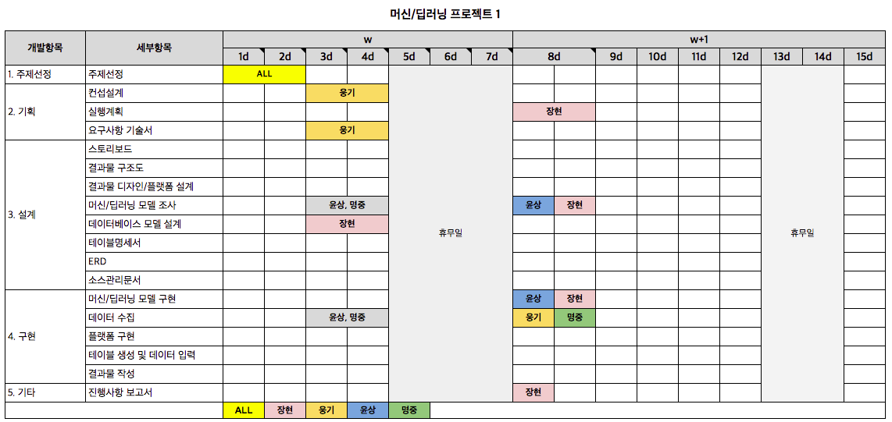

★머신/딥러닝 프로젝트★
========================

__-프로젝트1__ : 영화포스터 정보로 추측해보는 흥행예측

__-프로젝트 참가자__ : 안장현, 황윤상, 이웅기, 김명중

## - 진행 예정사항

### 1. 프로젝트 주제 선정

### 2. 목표 설정 

### 3. 기획
 : 컨셉, 실행계획 수립.

 : 산출물 - 요구사항 기술서, 스토리보드, 메뉴구조도, 착수/중간/완료 보고서 작성.

 : 추진일정(wbs) 작성.

### 4. 설계
 : 머신러닝 모델 선정

 : 데이터 베이스 모델 설계

 : 프로그래밍 언어 사용 및 역활, 사용되는 시스템 설계

 : 결과물에 대한 디자인 및 플랫폼 설계 

 : 산출물 - 디자인 시안(샘플링), ERD, 테이블 명세서, 프로그램 명세서, 소스관리 문서 및 폴더, 테스트 계획서

### 5. 구현 
 : 자료수집, 머신러닝 모델 사용, 결과출력

 : 데이터 수집/정제, 머신러닝 모델실행, 결과 수집, 플랫폼(웹,앱,ppt) 구현(보고용), 데이터 베이스 테이브 생성 및 데이터 입력

### 6. 발표
 : 프로젝트 완료 시 자체 발표

### 7. 끝
 : 프로젝트 2 진행
***

[WBC(작업테이블)](https://docs.google.com/spreadsheets/d/1FERX-ZtqsSrEMwRJI8FLhWq9nbFUzfE75uOCy7pMZB4/edit#gid=0)
***
### - 일정요약

###### 01일차 : 프로젝트 주제 선정 회의 1차 진행하였음.
###### 02일차 : 프로젝트 주제 선정 회의 2차 진행하여, 주제가 선택되고, 역활분담 진행
###### 03일차 : 프로젝트 주제에 대한 기획서 작성, 자료 수집, 머신러닝 모델 조사 및 선정, DB모델 설계 및 문서작성
###### 04일차 :
###### 05일차 :
###### 06일차 :
###### 07일차 :
###### 08일차 :
###### 09일차 :
###### 10일차 :
###### 11일차 :
###### 12일차 :
###### 13일차 :
###### 14일차 :
###### 15일차 : 프로젝트 결과물 발표 / 프로젝트 종료 / 프로젝트 2 주제 선정.

***
## ※ 공지사항
###### 루트 폴더는 소스만 추가할 것.
###### 개인별 폴더에 역활에 맞는 문서 및 소스를 추가할 것.
